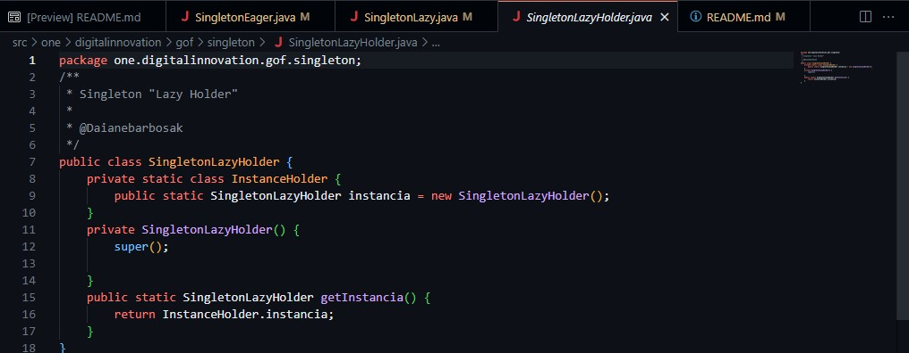

# lab-padroes-projeto-java
Repositório com testes de padrões de projeto em java: facade, singleton, strategy;

# Facade: 
O padrão de design Facade simplifica a interface para um sistema complexo.
Ele fornece uma visão simplificada do sistema, que é fácil de usar, ocultando 
os detalhes complexos do sistema.

Exemplo usado nos códigos:

# Singleton: 
O padrão de design Singleton restringe a instanciação de uma classe a uma única instância.
Este padrão é útil quando exatamente um objeto é necessário para coordenar ações em todo o sistema.

Exemplo usado nos códigos:

# Strategy: 
O padrão de design Strategy permite que o comportamento de uma classe ou seu algoritmo seja alterado
em tempo de execução. Neste padrão, criamos objetos que representam várias estratégias e um objeto
de contexto cujo comportamento varia conforme seu objeto de estratégia.

Exemplo usado nos códigos:

# Teste:

# Referências:

1. stackoverflow.com
2. en.wikipedia.org
3. en.wikipedia.org
4. tutorialspoint.com
5. en.wikipedia.org
6. zhuanlan.zhihu.com
7. howtodoinjava.com
8. devmedia.com.br
9. baeldung.com
10. geeksforgeeks.org
11. bing.com
12. Dio.me